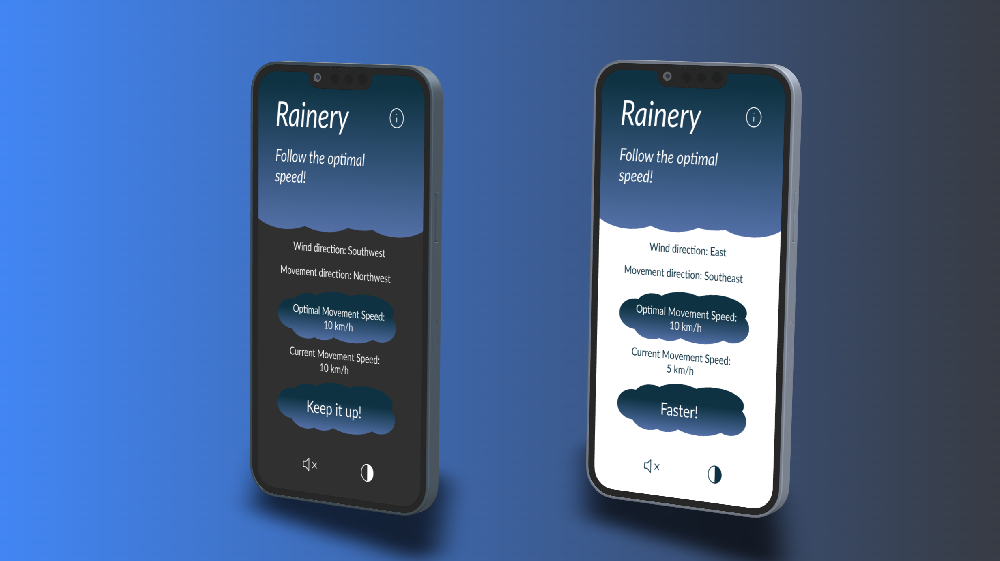

# Rainery

Rainery is a React Native based mobile application which reduces rain exposure of users by using movement speed and meteorological data.

## Installation
1. Install React Native CLI

```bash
npm install -g react-native-cli
```

2. Install required packages:

```bash
npm install
```
3. (iOS only) Pod install:

```bash
cd ios
pod install
```
4. (Android only) Configure Android Studio according to the official [RN instructions](https://facebook.github.io/react-native/docs/getting-started) (Building Projects with Native Code, macOS, Android)
## Usage
Before starting, you should launch device emulator (or actual device) to run the app in Android. In order to run the app on a real device, follow [React Native official guide](https://facebook.github.io/react-native/docs/running-on-device.html) for your own setup.

```bash
react-native run-android
react-native run-ios
```
## Dependencies
* [Axios](https://www.npmjs.com/package/axios)
* [React Native Async Storage](https://www.npmjs.com/package/@react-native-async-storage/async-storage)
* [React Navigation](https://reactnavigation.org/docs/getting-started/)
* [Expo](https://expo.dev/)
* [React](https://reactjs.org/docs/getting-started.html)
* [React Native](https://reactnative.dev/docs/getting-started)
* [react-native-geolocation-service](https://www.npmjs.com/package/react-native-geolocation-service)
* [react-native-gesture-handler](https://www.npmjs.com/package/react-native-gesture-handler)
* [react-native-headphone-detection](https://www.npmjs.com/package/react-native-headphone-detection)
* [react-native-navigation-bar-color](https://www.npmjs.com/package/react-native-navigation-bar-color)
* [react-native-reanimated](https://www.npmjs.com/package/react-native-reanimated)
* [react-native-safe-area-context](https://www.npmjs.com/package/react-native-safe-area-context)
* [react-native-screens](https://www.npmjs.com/package/react-native-screens)
* [react-native-sound](https://www.npmjs.com/package/react-native-sound)
* [react-native-svg](https://www.npmjs.com/package/react-native-svg)
* [react-native-svg-transformer](https://www.npmjs.com/package/@ornikar/react-native-svg-transformer)
